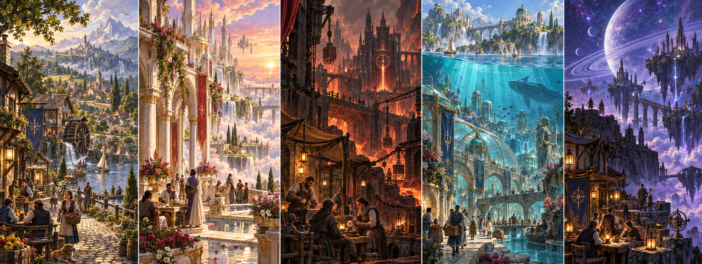
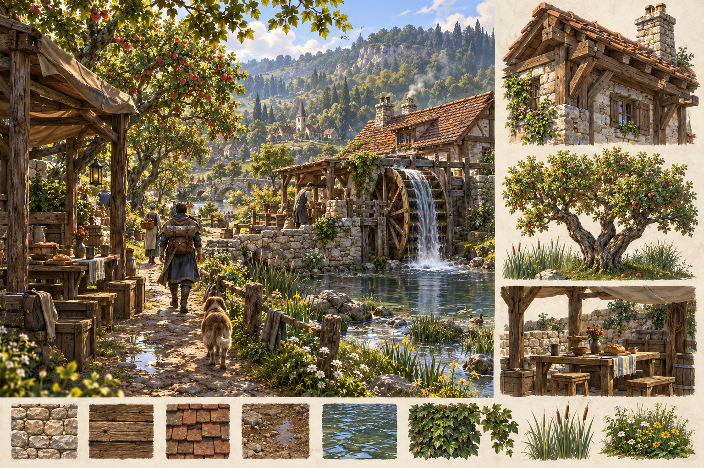

# Firstlight visual direction, 2026-09-30

Generated concept art based on four preserved ChatGPT-session references and all five realm design packages. This visualizes the whole game's ambition; it is not a screenshot, playable geography or a finished asset pack. The runtime atlas labels current Earth/Cosmos openings separately from future Heaven/Hell/Atlantis.

The immediate reusable vocabulary is timber structure, pale riverstone, restrained clay roofs, worked earth, forked orchard crowns and sheltered communal objects. Actual procedural geometry was refined in this pass. The painted material richness is still ahead of the renderer. The board's tall cities, sky objects and water structures are illustrative, not final scale/placement decisions. Cosmos should keep one dominant sky object in playable geography despite the board's secondary moons.

## Generation record

Built-in image generation was used twice in referenced-image mode, with opaque backgrounds. Original PNGs are preserved here. See ASSET_MANIFEST.json for input/output hashes and the lossily compressed, unchanged-composition WebP runtime derivatives. No external stock texture or model was acquired. The dependency-free builder embeds the WebP files into both identical standalone HTML outputs; file-origin/offline tests decode them under the existing data/blob-only image policy.

World-board prompt brief: five equal vertical panels, left-to-right Earth/Heaven/Hell/Atlantis/Cosmos; painterly mythic realism; no text, logos or slogans. Earth ordinary village/mill/orchard; Heaven inhabited pearl/gold/ruby garden terraces at dawn; Hell safe amber refuge before coercive basalt industry; Atlantis continuing ocean city with surface and dry-air courts; Cosmos grounded Three Lamps with charcoal stone and warm habitation beneath a dominant celestial body. The four existing images were ancestry references, explicitly redesigned rather than copied.

Hearthwater prompt brief: practical wide environment/material sheet; human-height path, river pond, functional timber wheel, riverstone retaining wall and mill shed, heavy joinery, clay shingles, forked apple trees and a table after rain. Right-hand studies show a building corner, robust orchard tree and shelter. Warm timber/cream-grey stone/dark greens/blue-grey water; no lettering, combat or magic explosion. Earlier Earth concept supplied visual ancestry.

## Asset needs for the next measured art slice

Nothing is required from Dom to play this build. For the next visual step, the most useful inputs are original full-resolution character/costume drawings from the ChatGPT canon and founder picks for one Earth house and one traveler silhouette. Preserve names/source dates so references remain traceable.

Engineering should first prove one small compatible mesh/material import against this custom offline WebGL renderer. Only then select a licensed modular timber/stone kit or produce it in Blender. Desired small kit: one house corner/door/window/roof set, one orchard tree, one reed patch and one traveler base mesh with blade/bow/armor attachment points. Target low-poly silhouettes with a single restrained material atlas and no external runtime dependencies. Exact budgets follow measured renderer compatibility; Blender assets cannot currently be assumed to load just because a GLB exists.

Prefer original work or explicitly licensed reusable assets, and retain source/license receipts when acquired. No broad texture shopping or asset download is needed before the import path exists. Character animation, tactile materials, authored landmarks and human camera/visual feedback are still separate next work, not claims delivered by these paintings.
