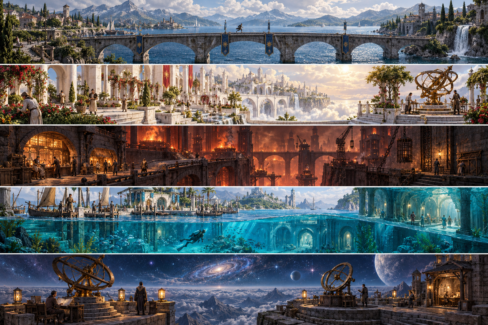

# An inhabited world: environment direction

This original concept sheet was generated with the built-in image-generation tool on 2026-10-02, following Dom's authorization to develop the game creatively from the recovered realm vision. It is an art target for later geometry and material work, not a gameplay screenshot, an imported asset pack, or founder-approved final architecture. The playable five-trail milestone is described in [the implementation record](../development/REALM_OUTINGS_2026-10-02.md).

From top to bottom: Earth, Heaven, Hell, Atlantis and Cosmos. The inhabited landscapes and distinct materials follow the [recovered vision index](COMPREHENSIVE_VISION_INDEX.md); the compositions and architectural details are new Codex interpretations. Earth remains the home anchor. Heaven's welcoming public garden does not settle the summit or divine truth. Hell's lit refuge does not decide guilt or allegiance. Atlantis remains a living maritime civilization. Cosmos has occupied ground and instruments under an extraordinary sky, without establishing physical travel to its sky images.

The long Earth bridge addresses Dom's foundational image of a traveler, beautiful water, distant mountains and cloudy sky. The concept's country-scale water and settlements are future scope; the current playable Coastward channel and bridge have bounded measured geometry. The Heaven arm is a larger art interpretation of the existing repaired public instrument. Atlantis's cutaway waterline illustrates the spatial idea; production swimming and dry air courts still require their real medium and clearance rules.

| Next reusable art set | What to prove in the game before adding scale |
| --- | --- |
| Earth bridge pier, masonry edge and varied shore rocks | A readable running silhouette in both cameras, supported ground, stable water reflections and affordable draw cost |
| Heaven pale-stone garden edge, planted arch and brass return arm | A welcoming inhabited garden, visible repair state, reduced-motion parity and uncluttered interaction points |
| Hell iron clamp, kiln doorway and refuge window | Safe-route contrast, real cover and sight lines, recognizable waiting/arrived Neris and a readable recovery tell |
| Atlantis wet masonry, civic depth marker and air-court doorway | Character/camera medium separation, clear entry/exit volumes, depth legibility and an inhabited modern culture beside old stone |
| Cosmos paired sight frames, crown parapet and lamp base | Distinct world silhouettes, actual aligned feedback, accessible controls and supported navigation under one up direction |

Start with small original mesh/material sets and use the current renderer's compatible paths. A scenery image is not a collision mesh, material atlas, normal map, texture licence or working streaming system. Do not promote it into a runtime surface without checking the actual importer, dimensions, memory cost, camera views and physical boundaries. Broader capitals and countries should grow from playable connected routes rather than disconnected painted backdrops.

The complete generation prompt is preserved in [the art receipt](REALM_ENVIRONMENT_ART_RECEIPT_2026-10-02.json). Existing gameplay images and videos retain their separate measured receipts.
