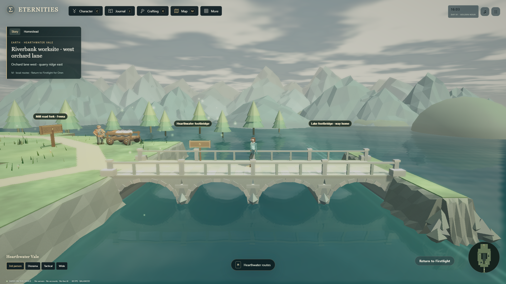
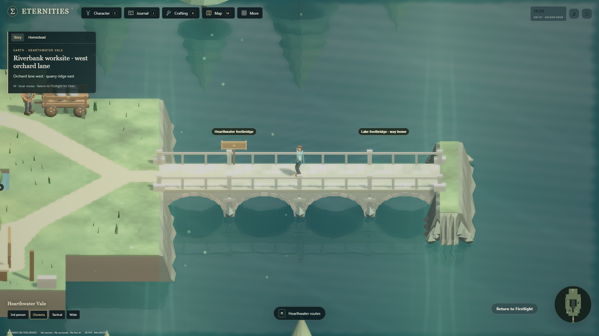

# Actual bridge shoreline evidence

Source `ae8ce93c79f45839256d4475daf44beb12b6d161`, HTML `c4184ebcbc032dd57deb710eeb119422ecde36a1914dd305617cee49f049231c`. Exact delivery head/fresh-clone and hosted
receipts are in the review PR. All images/video are captured from gameplay.

Video: silent 32.52s,1280x720,H264,813encoded frames at25fps,17ordinary accepted
walk/UI actions. Fresh production-created character, no grants/teleport/fixture
or accelerated ticks. ANGLE RTX3080 D3D11. Encoding rate is not game FPS.
Stride still is the unedited decoded frame at17s. Full MP4 decode exit0.

Matched before/after GPU probes use the same production route/cameras,1080pDPR1
balanced,360ordinary RAF intervals per camera/build,1.5s warmup excluded, no video
or accelerated ticks. P95after16.7ms,max16.8ms,zero>33.333ms. Quantized short
headless intervals are not sustained render timing,monitor or human qualification.
One extra batch,+1instance,-5448triangles,unchanged1,747,625estimated texture bytes.
Draw snapshots vary with existing shadow cadence, not a fixed pass cost.
Measurement setup hashes identify the raw D JSON; SETUP_SOURCE_BYTES.json
preserves its exact bytes while the human-readable Git copy uses LF newlines.

Full clean exact-source proof:58syntax,675Node,53Python+1existingWindows skip,
24earned journeys,1598browser assertions/19suites;zero failures. Source proof
on small linked C checkout omits only evidence media; durable artifacts on D.
Browser report separates synthetic pixel probes from visible normal app RAF.
Both projected water/haze affect real pixels;non-Earth difference0,GLerror0.

Independent source and screenshot review are limited as stated in REVIEW.json.
The far bank remains a constrained rocky landing; near rail hides some legs,
and arch reflections/mountains remain stylized. Human acceptance pending.
No save/schema or navigation migration. No merge/deployment.
