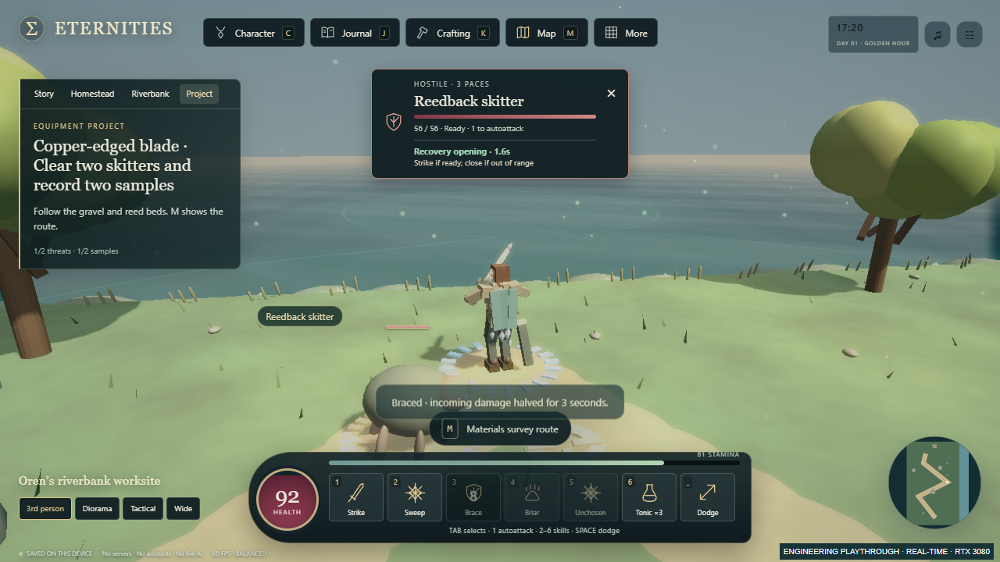
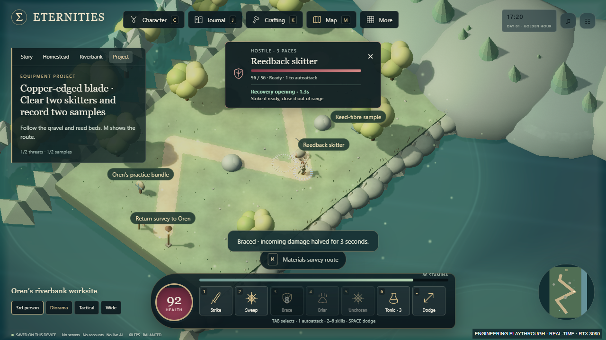

# Read the fight: actual prototype evidence

Source5633cef5aaf1d25f4eecb5664acb4608c17fd806, stacked on PR30
de3ffb654cd1661d49b6d26ebcd866c09f1b2310. Both generated HTML files are identical:
2,253,455bytes, SHA256 f5d5405ceb4ea0e116c45eb18af3009bc94c91f378d36d5a6739de57e2b01088.

[Actual outing](actual-outing.mp4) is silent28.52s1280×720 H264,713 decoded frames.
The25fps encoding rate is not renderFPS.29 checkpoints cover27.59s normal-time
browser action from the labelled [earned accepted survey](EARNED_RECORDING_SOURCE.json).
No simulation stepping, planted defeats, equipment grants or invented participants.
The controller used visible cue state, actual UI and accepted movement/selection.
Two threats/samples, one survey payout and one explicit16→18 blade fitting; no
auto-equip, Oren acceptance, campaign advancement or XP award. Viewport and confirmed
RTX3080 ANGLE/D3D11/browser provenance are in [video receipt](VIDEO_RECEIPT.json).

Other actual stills include the warning, reward comparison and fitted blade.
Bow/veteran opening PNGs are command-earned sources with accelerated browser tactics.
Compact/ward PNGs are explicitly synthetic owner/layout boundaries: they verify
containment and separation, not real campaign acceptance or mobile comfort.
[Browser report](BROWSER_REPORT.json) has62checks; [source proof](SOURCE_VERIFICATION.json)
has58syntax/704Node/53Python plus1existing Windows skip/24earned journeys/
1744browser assertions in20suites, no failures. Full logs remain in the delivery
artifact directory onD. The PR records the final exact pushed-head clone results.

[Matched GPU report](GPU_COMPARISON.json):1920×1080DPR1,balanced,360ordinary RAF
samples per selected-survey camera/build, confirmedRTX3080/driver610.74/Chromium
143.0.7499.4. AfterP95≈16.8ms,max≈16.8ms,no intervals>33.333ms. Both builds have
matching sampled geometry/draw counts. This is a short headless sample, not GPU
completion/monitor timing/sustainedFPS/human reaction or comfort. [Raw reports](GPU_AFTER.json)
and [portable exact setup bytes](GPU_SETUP.json) make the measurement addressable.

[Independent bounded source/visual review](INDEPENDENT_REVIEW.md) keeps its limits
and initial corrected findings. No reviewer browser run or full-video watching.
The hash inventory covers the final evidence bytes after Git normalization.

Local play: run `PLAY_FIRSTLIGHT_WINDOWS.cmd` from this gameplay checkout when
the older8780 preview has been closed; it refuses a different build on the same
origin. Initial kit at Oren→Field guide→Start survey→riverbank sign/E; Tab or click
selects,1toggles stationary attacks,3Braces,Vswaps the two cameras. Personal saves
were not used. No main merge/public deploy or persistent-preview bypass occurred.
