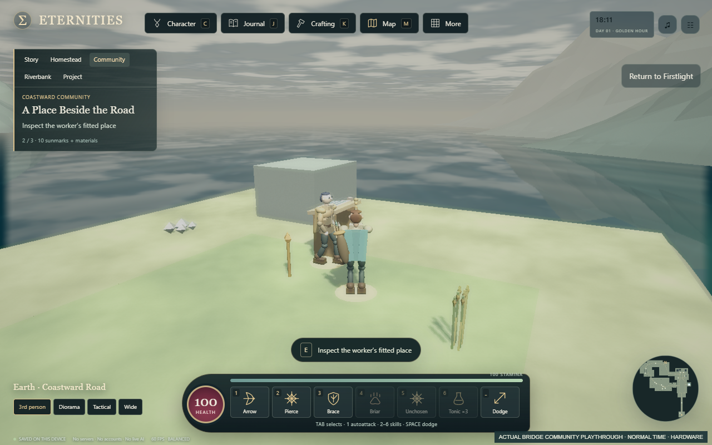
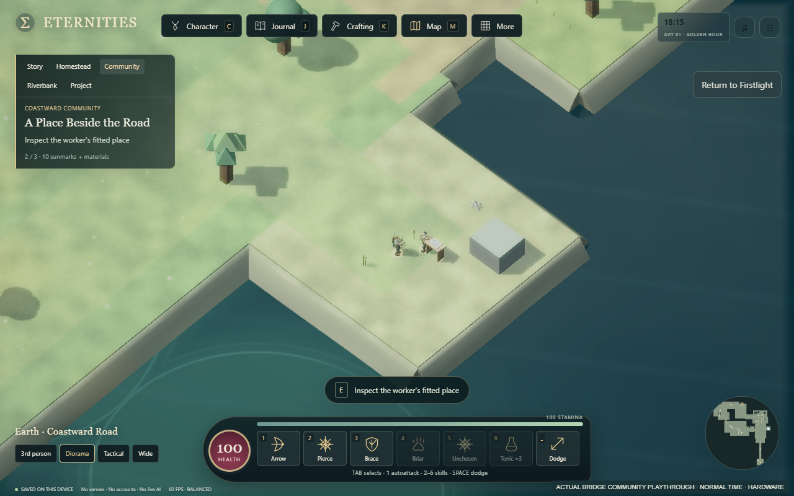
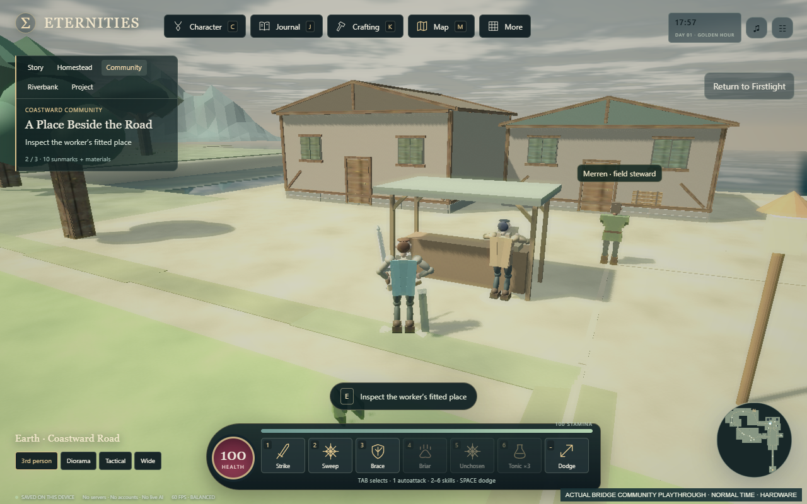
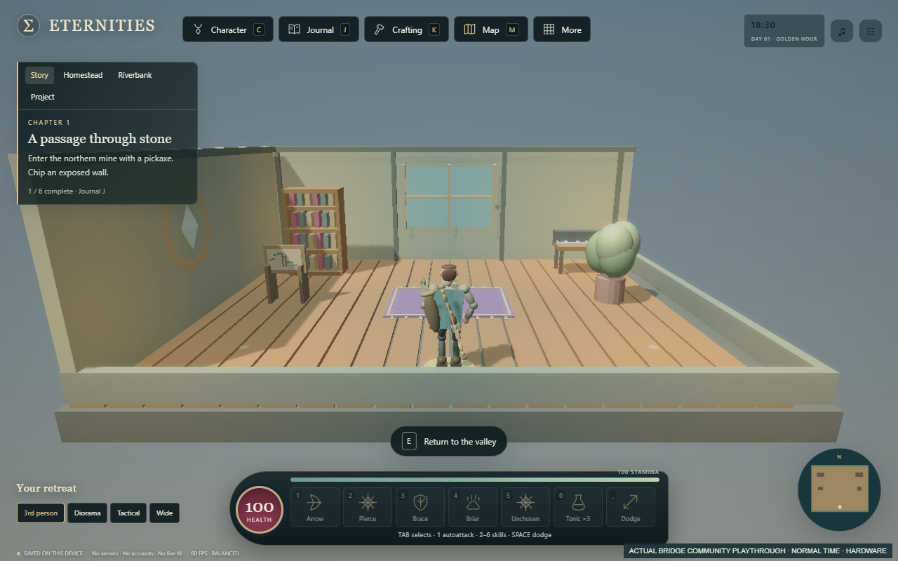

# A Place Beside the Road: final evidence

Playable implementation: [PR 41](https://github.com/EternitiesAi/eternities-firstlight/pull/41), explicitly stacked against open PR40. Base `4240d9eaefb81d492040295b5b2b70e08e4245c8`; tested/recorded runtime `d7a434b238c662a77eb3318ddee7626732c416a5`; documentation-only delivery head `4ee5854aa991c1eec019527c9e4944db060a668f`. This evidence branch adds records/media under this directory and inherits the delivery source. It does not change gameplay or verifier inputs.

Accept Merren's disclosed terms after the initial kit, cross the existing bridge for supplied fittings, choose the settlement shelter or river observation stand, fit and inspect it in use, return for an explicit once-only fee, then deliberately craft/place one Crossing route-board at home. The fee is 10 sunmarks + 2 timber + 4 meadow fibre, zero XP/ore or personal-material cost. The separate finite home craft costs 2 timber + 1 fibre. The scenario and art are original provisional adaptations.

## Verification epochs

| Execution | Actual result | Evidence |
|---|---|---|
| Fresh remote clone, runtime d7a434b, `python tools/verify.py --browser` | 97 syntax modules; 1153/1153 Node; 56/57 Python pass + one existing Windows symlink skip; 46 earned journeys; 41/41 browser suites |[runtime receipt](RUNTIME_VERIFICATION.json), [full log](FULL_VERIFY.log), [rules](rules.log), [Python](python.log) |
| Same fresh remote clone fetched/checked out delivery 4ee5854, `python tools/verify.py` |Same source gate passes; all non-doc Git entries match the tested runtime exactly |[delivery receipt](DELIVERY_HEAD_VERIFICATION.json), [source log](DELIVERY_SOURCE_VERIFY.log) |
| Native community suite at runtime d7a434b |259 passed /0 failed; 21 whole-browser restarts across earned blade, bow and strongest returning cases |[native report](BRIDGE_BROWSER_REPORT.json) |
| Normal-time visible-UI shelter and lookout, runtime d7a434b |21/21 each; complete route/payment/home craft/placement, no position/resource grants or accelerated ticks |[shelter report](SHELTER_NORMAL_UI_REPORT.json), [lookout report](LOOKOUT_NORMAL_UI_REPORT.json) |

Both generated HTML files rebuild identically: 2,688,816 bytes; SHA256 `1e0b58dbcfb383a832f279d748d0f0a9a75459f9cf804d40f7e6c272cf008c0a`. Native checkpoints reconcile the latest observed successful Storage bytes with raw startup before hydration at accepted, carried, fitted-uninspected, complete-unpaid, paid-before-home, crafted and placed states. Refused quota/capacity and changed request IDs do not grant duplicate payment. Matched appearance controls restore pixels/batches/authority and explicitly test normal shelter-camera distance at the earlier failing position.

Hosted run [37181713494](https://github.com/EternitiesAi/eternities-firstlight/actions/runs/37181713494) at the runtime and [37185252786](https://github.com/EternitiesAi/eternities-firstlight/actions/runs/37185252786) at the delivery head are account-billing blocked: 43 jobs each, zero steps. [Runtime jobs](CI_JOBS.json), [annotation](CI_ANNOTATIONS.json), [delivery jobs](CI_DELIVERY_JOBS.json), [annotation](CI_DELIVERY_ANNOTATIONS.json). Local Windows results do not imply current hosted Ubuntu success.

## Actual footage and GPU workload

[Watch the 64.96-second playable-loop excerpt](LOOKOUT_PLAYABLE_LOOP_65S.mp4). Six direct cuts from the normal-time lookout recording, no speed change or audio. It shows bridge travel, installation/use, both cameras, recognition, home project and return home. [Media receipt](MEDIA_RECEIPT.json), [full decode log](VIDEO_DECODE.log). Both complete raw recordings were fully decoded and remain in the D-drive artifact store.

Hardware WebGL2 renderer: ANGLE/NVIDIA RTX 3080/D3D11; driver 610.74; headless Chromium 143.0.7499.4; 1280x800; balanced. Four 600-scheduled-RAF-interval samples per recording have p50/p95 about 16.7-16.8ms, max 16.8ms, 0 intervals above 50ms. These samples include recording and concurrent CPU work. They are not isolated GPU time, monitor FPS or sustained performance certification. Encoder 25fps is a media setting, not game FPS.

## Migration, negative evidence and limits

World/key9, adventure12 and homeHistory1 remain. New optional bridgeCommunity1 defaults empty when absent, preserves valid current history and rejects malformed/future/impossible data. The fifth home definition is appended; old clients cannot understand that new furniture ID. Existing XP, gear/sockets/fittings, companion, housing/crops, notebook/music/exports, chapters and explicit soul/class choices retain their owners. Personal saves were not inspected.

[Retained failed native authoring epoch02](FAILED_NATIVE_EPOCH02_REPORT.json) has 49 positive checks, zero checked false conditions, then a nonexistent camera-locator exception: overall status **failed**. Its HEAD was the earlier base with uncommitted authoring sources; its HTML hash identifies that epoch, not final committed runtime. Earlier missing dependencies, bench-clipping route, quota-method restoration, guard/shaft and table/record defects stay recorded in the authoring results and D-drive logs. Positive pixels initially missed the contracted shelter camera; image review caused a source fix and distance regression. The earlier 247-check native pass is superseded by the final 259-check epoch, not relabelled.

Two read-only colleagues audited source/hash/count consistency and selected stills; they did not execute this full gate or provide human acceptance. Fixtures/worker/home details remain small in wide diorama and character models remain modular. Touch, arbitrary orbits, novice pacing, enjoyment, hard-crash durability and sustained performance are unqualified. The older LocalLife context-only shutdown rollback remains unexplained. Dom has deferred play. Main, public deployment and billing remain untouched. Desktop PR attachment was attempted but did not return; GitHub PR 41 is independently confirmed.

Launch the inherited build with `PLAY_FIRSTLIGHT_WINDOWS.cmd` or `python tools/play_local.py`, at `http://127.0.0.1:8780/`. Follow the [play guide](../../playtests/LIVING_REGION_2026-10-04.md) and [delivery note](../../development/LIVING_REGION_DELIVERY_2026-10-04.md). Next priority: one distinctive encounter in this inhabited region, with measurable blade/bow/strongest behavior and a visible community consequence. Human questions remain route clarity, recognition, fight appeal and whether the home trace makes the trip feel remembered.

Evidence text keeps its original CRLF bytes through scoped Git attributes. Packaging uses a CRLF-aware text check; the encoder progress line in VIDEO_DECODE.log intentionally retains its original trailing spaces and is excluded from that formatting check. Every committed evidence blob is checked against its original bytes. This packaging formatting exception changes no game/test acceptance result.
