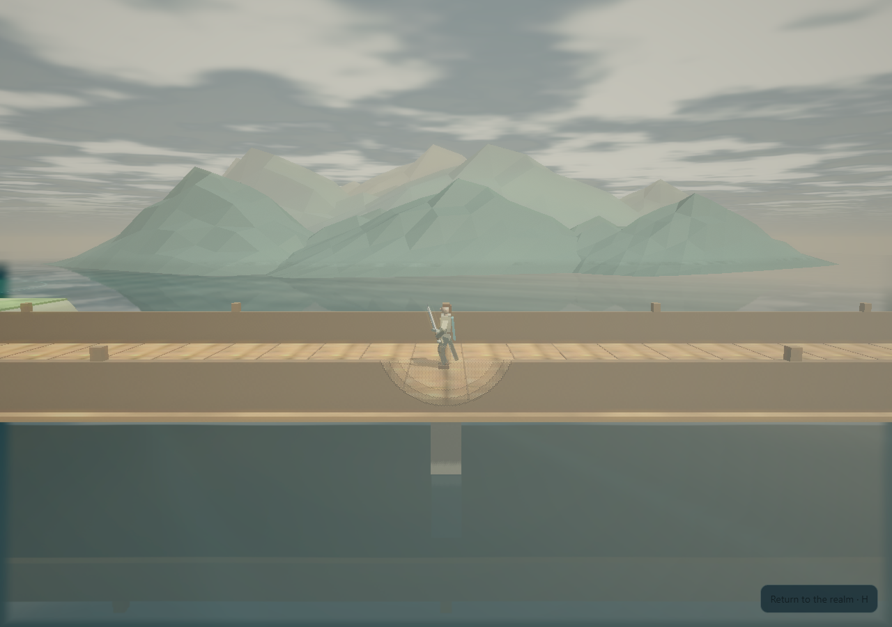

# An inhabited Firstlight: playable work and actual evidence

This seven-hour pass starts from PR36 at `25d932057bc91305a5c16c3291432a2351e7dfbf` and develops the browser game on `gameplay/world-production-pass-20261002`. The review stays stacked on `gameplay/realm-outings-20261002`. Main, deployment and the personal save origin are unchanged.

The real Coastward woodland now joins the existing roads, its banks meet the water, three settlement buildings have original exterior joinery, and the channel crossing frames layered mountains in third person. Nine local people, Briar, the skitters and accepted traveler attacks have recognizable geometry and motion. Journal/map progress follows saved accepted work. Coastward bundles, Atlantis readings, the corrected chart and the modern landing fitting appear only after the actual corresponding action. Optional ambience follows the existing app sound consent and realm/body medium.

The fixed optional starter pair lives long enough to show an attack cycle with the kit blade or crafted bow. Equipment rewards still require deliberate selection and equip. Existing once-only Oren rewards, repeat survey runs and the five realm story claims keep their separate identities. A returning earned Dawn Edge receives the existing finite fitting: the measured practice impact becomes **48→51** while its socket and earlier work remain. A full/refused reward stays unpaid. The reviewed workshop/Earth-story candidate boundary saves before adopting costs and ownership.

This image is actual recorded game geometry at HTML `cd532619…f54c`; it is not concept art. The companion diorama frame is [here](screens/bridge-layered-final-01/supported-bridge-diorama-side.png). The final Atlantis recording uses the current roof and nearby-work cutaway build, HTML `846eb86b…30c5`. `CAPTURE_EPOCHS.json` and the original per-take reports preserve every source hash instead of relabelling older footage.

## Play

Open `PLAY_FIRSTLIGHT_WINDOWS.cmd`, or run `python tools/play_local.py` from this checkout. The launcher uses `http://127.0.0.1:8780/` and checks build identity. Use the same browser/profile/origin to resume existing characters. If an older Firstlight preview still occupies that port, close it yourself and relaunch. The earlier automatic restart was rejected before execution; no alternate kill or save-origin change was attempted.

At the outdoor bench, use **K → Walk to Oren**, then **K → Collect supplies** to obtain the initial kit. The nearby **Roads of Light** marker opens all five regions without chapter, class or soul-choice requirements. **J → Roads** explains the chosen trail; **M** shows the local route; **E** interacts. **Tab/click** selects, **1** toggles stationary autoattack, **3** braces. **V** swaps cameras and **R** resets the current framing. At Coastward's channel marker, **E → Frame the channel bridge** gives the supported side view while retaining preset/FOV.

Atlantis's marked visitor gallery uses camera-relative **WASD**, **F** rise and **G** descend. Released keys hold depth. The actual Bellglass air court reveals its roof through the existing camera-cutaway setting; turning that setting off restores the ceiling. The initial air envelope has no timer. Free home return remains available. [The complete play guide](../../PLAY_REALM_TRAILS.md) gives declared rewards, escort controls and the finite fitting.

## Evidence boundaries

- [Media and decoded stream receipts](MEDIA.md) describe the actual normal-RAF RTX recordings. The canvas includes opted-in app audio; its DOM menus/HUD are supplied by separate full-page stills or an explicitly silent UI recording. Imported fixtures are command-earned and labelled; fixture generation can use accelerated rule ticks, while these filmed outings do not.
- [The final hardware report](hardware/18f34b0/REPORT.json) records renderer/driver, resolution/quality, twenty fixed scenes and 12,000 actual normal-RAF frame intervals. All scenes have P50 about 16.7 ms and P99 at most 16.8 ms; one maximum is 33.4 ms and no sample exceeds 50 ms. Firstlight browser/FFmpeg workers were quiet; other desktop apps were not terminated. Actual RTX 3080 acceleration was verified at 1920×1080, balanced quality, Chromium 143.0.7499.4 and NVIDIA driver 610.74. Its browser cadence is separate from GPU render time, display timing, combat load and human feel.
- [The native Southern work suite](browser/realm-work-18f34b0/REPORT.json) passes 259 checks in both default camera presets, including actual held-key swimming, work-only visual changes, reloads and a refused/retried claim. Five-pixel gauge details establish contribution, not human readability. Source gates, native browser suites and the final exact pushed-head remote clone have distinct receipts. The delivery PR gives the final head and fresh full-gate result. The earlier partial gate and actual defects remain in `negative/`.
- Independent bounded source/still reviews cover only their stated files, reports and images. They do not establish a complete audit, whole-video review, human enjoyment or controller/touch qualification.

World/key **9**, adventure **11**, journeys **1**, realm trails **1** and realm fitting **1** are unchanged in this pass. No new save field/key/migration, XP rescaling, class assignment or story consent is introduced. Notes/music/exports, home/construction/crops, equipment/sockets/earlier fittings, companion and completed choices keep their existing owners. Automated saves are disposable; personal saves are not inputs.

The current places remain bounded authored regions. Full countries/capitals, seamless streaming, production multiplayer, controller/touch, mature economy/endgame, art LODs and human listening/play acceptance need further work. Shallow near-rail angles can obscure legs; the diorama practice label can overlap the head; the recorded underwater gauge tabs contribute only five pixels apiece at the default diorama framing, despite passing the actual visibility control; human readability remains pending. Tiny tools and the near-Istra framing still deserve measured refinement. Founder decisions about paid power, offline loss, rare-pet allocation and construction scale remain unresolved.

For Dom, play one fresh and one returning case and answer: **Did you know where to go? Did fights feel better? Did the reward make you want another outing?** Compare both cameras and the route home. The automated results do not answer those questions.
